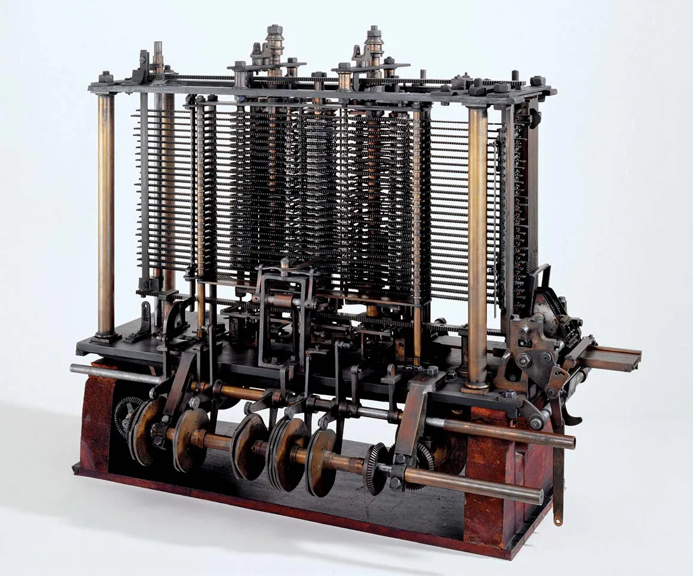

# المحاضرة 1
## مقدمة
### د. سهيل الحمود
### د. أسامه ناصر
2025-2026
---

# الفهرس
- مالذي سنعترف عليه في هذا المقرر
- ما هو الحاسب
- ما هي البرمجة
- ماهي لغة البرمجة
	- ماهي المتحولات
	- ماهي التوابع
	- ماهي المصفوفات
	- ماهي المؤشرات
	- ماهي الأغراض
---

# مالذي سنعترف عليه في هذا المقرر
- مبادئ وأساسيات البرمجة
- تطبيق هذه المبادئ والأساسيات على لغة البرمجة C++
	- البرامج البسيطة
	- تعريف المتحولات
	- بنى التحكم
	- المصفوفات
	- الملفات
	- المؤشرات وسلاسل الحروف
	- البرمجة الغرضية التوجه
- التعرف على مفهوم الخوارزميات
---

# ماهو الحاسب
- الحاسب هو عبارة عن آلة قادرة على تنفيذ مهام مختلفة وفق سلسلة من التعليمات المتتالية تسمى البرامج
- مما يتكون الحاسب؟
	- وحدات الإدخال: مسؤولة عن إدخال البيانات والأوامر إلى الحاسب
		- لوحة المفاتيح (keyboard)، الفأرة (Mouse)، لوحة اللمس (Touchpad)، شاشة اللمس (Touch Screen)، الكاميرا (Camera/Webcam)، المايكروفون (Microphone)، الماسح الضوئي (Scanner)
	- وحدات الخرج مسؤولة عن عرض ناتج العمليات على البيانات المدخلة
		- شاشة العرض (Display /Screen)، مكبر الصوت (Speaker)، الطابعة (Printer)
	- وحدة المعالجة المركزية CPU: دماغ المعالج والمسؤولة عن تنفيذ التعليمات المختلفة ضمن البرامج
	- وسائط التخزين: البيئة التي تخزن البيانات
		- قرص صلب HDD، قرص مرن Floppy Disk، قرص ليزري CD/DVD/BDVD، الفلاشة USB Thumbstick/Drive، وسيط التخزين SSD
---

# ماهو الحاسب
- الحاسب هو عبارة عن آلة قادرة على تنفيذ مهام مختلفة وفق سلسلة من التعليمات المتتالية تسمى البرامج
- مما يتكون الحاسب؟
	- الذاكرة الرئيسية Main Memory (aka RAM): مكان التخزين لكل ما يتم تنفيذه حالياً من برامج
	- بطاقة الإظهار Display Card: شريحة تتضمن عليها وحدة المعالجة الرسومية GPU والمسؤولة عن بناء الصورة المطلوب عرضها على الشاشة
		- nVidia GeForce RTX 4090
	- مخارج الربط: هي المخارج التي تربط الحاسب مع العالم الخارجي:
		- USB مخارج دخل\خرج يتم وصل تجيزات عديدة عليها (لوحة مفاتيح، فأرة، فلاشة...الخ)
		- VGA/HDMI/DisplayPort/DVI مخارج متنوعة لوصل الشاشات على الحاسب
		- Ethernet ماخذ لتوصيل الشبكة السلكية إلى الحاسب
		- NVME مأخذ وبروتوكل لتوصل أجهزة التخزين السريعة SSD إلى الحاسب
		- PCI-Express مأخذ وبروتوكول لتوصيل الإضافات للحاسب (بطاقة إظهار)
---

# ماهو الحاسب
- الحاسب هو عبارة عن آلة قادرة على تنفيذ مهام مختلفة وفق سلسلة من التعليمات المتتالية تسمى البرامج
- مما يتكون الحاسب؟
	- اللوحة الأم Motherboard
		- مكان تركيب كل ماسبق
---

# ماهو الحاسب
## لمحة تاريخية سريعة
- إن الحاسب كما نعرفه اليوم ليس من انتاج شخص وإنما نتاج مجموعة كبيرة من الأبحاث عبر القرون
- يمكننا النظر للساعات البدائية على أنها شكل من أشكال الحواسيب نظراً لاحتسابها الوقت
- لكن إذا أردنا أن نحدد نقطة بداية، نلجأ عادة لتثبيت معها تشارلز بابيدج
---

# ماهو الحاسب
## لمحة تاريخية سريعة
### المحرك التحليلي  Analytical Engine
<div grid="~ cols-2 gap-4">
<div>

- جهاز حسابي تم تطويره من قبل تشارلز بابج Charles Babbage في القرن 19  
- لم ينته من بنائه بشكل كامل
- كمبيوتر ميكانيكي يعمل بالبخار:
  - الحجم: 10 × 30 أمتار
  - الذاكرة: 20.7 كيلوبايت (بمعايير اليوم)
- الهدف: أتمتة العمليات الحسابية المعقدة
- نظام التحكم:
  - البطاقات المتقوية
  - لغة برمجة مع حلقات واختيار شرطي
- عرض النتائج عبر الطابعة / راسمة خطوط / الألواح المعدنية

</div>
<div>
      
</div>
</div>
---

# ماهو الحاسب
## لمحة تاريخية سريعة
### المحرك التحليلي  Analytical Engine
<div grid="~ cols-2 gap-4">
<div>
    
- ضمن فريق بابج: أدا لافليس (Ada Lovelace)
- اسمها الكامل أوغستا آدا كينغ، كونتيسة لوفليس - Augusta Ada King, Countess of Lovelace
- كانت متخصصة في الرياضيات
    - خلال فترة تسعة أشهر بين عامي 1842 و1843، ترجمت مقال عالم الرياضيات الإيطالي لويجي مينابريا حول أحدث آلة اقترحها باباج، وهي المحرك التحليلي.
    
       
</div>
<div>
    
</div>
</div>
---

# ماهو الحاسب
## لمحة تاريخية سريعة
### المحرك التحليلي  Analytical Engine

- ضمن فريق بابج: أدا لافليس (Ada Lovelace)
- اسمها الكامل أوغستا آدا كينغ، كونتيسة لوفليس - Augusta Ada King, Countess of Lovelace
- كانت متخصصة في الرياضيات
	- مع ملاحظة أن الترجمة حوالي 3 أضعاف طول المقالة نفسها، وتتضمن (في الملاحظات) بالتفصيل الكامل، طريقة لحساب تسلسل أرقام برنولي باستخدام الآلة التحليلية
	- كان من الممكن أن تعمل بشكل صحيح لو بُنيت آلة باباج
- لذلك تعد أول مبرمجة في التاريخ
---

# ماهو الحاسب
## لمحة تاريخية سريعة
### آلة تورينغ

<div grid="~ cols-2 gap-4">
<div>

- حاول تبسيط وإضفاء الطابع الرسمي على نوع العمل الذي تقوم به الحسابيين البشريون Human Computers
- كما كان له دور كبير في الذكاء الصنعي من خلال تطويره لاختبار تورينغ
- أما أشهر أعماله كان كسر شيفرة Engima النازية خلال الحرب العالمية الثانية


</div>    
<div>
    
</div>
</div>
---

# تعريف الحاسب
## لمحة تاريخية
- لم يتوقف تطور الحاسب أبداً، إذ كان لتطوير الترانزستور من قبل ويليام شوتكي دور كبير في الحجم واستهلاك الكهرباء
- كما كان لذلك دور أساسي في تطوير مفهوم الدارات المتكاملة Integrated Circuit التي تضع كل الترانزستورات على قطعة واحدة (كرت الـ SD المستخدم ضمن الموبايل عبارة عن دارة متكاملة IC)
- توجد محطات كثيرة سنركز فيها على شخص محدد هو دينس ريتشي
--- 

# تعريف الحاسب
## لمحة تاريخية
### دينس ريتشي
<div grid="~ cols-2 gap-4">
<div>

- أحد أهم رواد علوم الحاسب وكان له دور كبير في تطوير نظام Unix ولغة البرمجة C    
- C
	- ماتزال تستخدم هذه اللغة حتى اليوم على الرغم من أن عملية التطوير تمت في الثمانينات من القرن الماضي
	- تستخدم في شكل أساسي في برمجة نظم التشغيل وبرمجة المتحكمات المكروية

</div>
<div>
    
</div>
</div>
---

# تعريف الحاسب
## لمحة تاريخية
### بيورني ستراوستروب
<div grid="~ cols-2 gap-4">
<div>

- عالم سويدي اطلع على لغة C وقال في نفسه: "أممم، تقبل التعديل"
- التعديل الذي قام به قام بتسميته C++
- تم توسيع لغة C لتضمن ميزات إضافية من قبل بيورني ستراوستروب عام 1985
- من الميزات التي إضافتها هي البرمجة الغرضية التوجه التي لم تكون موجودة في C
</div>
<div>
    
</div>
</div>
---

# ماهي البرمجة
- الحاسب لا يفهم البرنامج ككتلة واحدة
- إنما يفهم البرنامج على أنه مجموعة من التعليمات المتتالية التي يعمل على تنفيذها
- لكي نوضح هذه التعليمات يجب أن نقوم بكتابتها بالاعتماد لغة خاصة تسمى لغة الآلة
	- لغة صعبة ومعقدة مكونة من سلسلة من الأصفار والواحدات
	- غير مخصصة للبشر وأنما مخصصة للآلة
	- لذلك نلجأ لكتابة البرامج بلغة مفهومة من قبل البشر
	- نحول البرنامج المكتوب من اللغة المفهومة من قبل البشر إلى لغة الآلة
	- عملية الكتابة والتحويل هي عملية البرمجة
---

# ماهي البرمجة
- للمقاربة يمكننا النظر إليها بالشكل التالي:
	- طلب منك كتابة موضوع تعبير باللغة الإنكليزية
	- أنت لا تجيد الإنكليزية
	- تقوم بكتابه بالعربية
	- يقوم زميل لك بترجمته للإنكليزية
- في هذه الحالة تكافئ اللغة الإنكليزية لغة الآلة
- اللغة العربية هي اللغة المفهومة للبشر التي نقوم بكتابة البرنامج (موضوع التعبير) بها
- أما الزميل الذي يترجم فهو المترجم Compiler أو المفسر Interpreter
---

# لغة البرمجة
## التعريف
- هي لغة خاصة تكون مكونة من مجموعة من الكلمات المحجوزة وتتبع نظام قواعدي ذو اساس رياضي تستخدم لكتابة البرامج
- كلمات محجوزة ؟
- نظام قواعدي ذو اساس رياضي؟ ما دخل الرياضيات بالموضوع؟
	- الرياضيات اساسية في البرمجة إذ أن كل لغات البرمجة توصف بالاعتماد على النموذج القواعدي خارج السياق (مقرر الأتومات واللغات الصورية، السنة الثالثة)
	- كما أن الاحتمالات والإحصاء اساس الذكاء الصنعي
	- الجبر البولياني أساس بناء الحاسب
--- 

# لغة البرمجة
## البنية الأساسية
- لدينا في اللغة العربية  نوعين من الجمل فعلية واسمية
	- شرب الطفل الماء: جملة فعلية من فعل، فاعل ومفعول به
	- السماء جميلة: جملة اسمية من مبتدأ وخبر
	- كمل يمكن تركيب هذه الجمل بالشكل التالي:
		- الحق ينتصر: مبتدأ وجملة فعلية في محل رفع خبر
- في لغات البرمجة لا يوجد تفصيل مثل هذا، لكن يمكننا تقسيم الجمل فيها إلى نوعين
	- جملة تعريفية تعمل على تعريف متحول أو تابع
	- جملة تنفيذية Action تقوم بتنفيذ مهمة ما
	- جملة مساعدة تعمل على تمضين مكاتب مختلفة كي لا نعيد اختراع العجلة
---

# لغة البرمجة
## البنية الأساسية
- جمل؟ ألم تقل أن البرنامج مكون من مجموعة تعليمات متسلسلة؟
- نعم يمكن النظر للجملة على أنها تعليمة
<div grid="~ cols-2">
<div>

- أول سطرين هما جملة مساعدة (تعليمات إدراج وتحديد عمل)
	- #include هو أمر ادراج الملف الرئسي iostream
	- يحتوي هذا الملف مجموعة من الأوامر والعمليات التي يمكننا استخدامها ترتبط بالقراءة والكتابة على سطر الأوامر
</div>
<div>

```cpp {1,2}
#include<iostream>
using namespace std;
int main(){
	cout<<"Hello world";
	return 0;
}
```
</div>
</div>
---

# لغة البرمجة
## البنية الأساسية
- جمل؟ ألم تقل أن البرنامج مكون من مجموعة تعليمات متسلسلة؟
- نعم يمكن النظر للجملة على أنها تعليمة
<div grid="~ cols-2">
<div>

- السطر الثالث جملة تعريفية
	- <div style="direction: ltr">int main()</div>
	- تعريف التابع main الذي يمتلك المستقر int
</div>
<div>

```cpp {3}
#include<iostream>
using namespace std;
int main(){
	cout<<"Hello world";
	return 0;
}
```
</div>
</div>
---

# لغة البرمجة
## البنية الأساسية
- جمل؟ ألم تقل أن البرنامج مكون من مجموعة تعليمات متسلسلة؟
- نعم يمكن النظر للجملة على أنها تعليمة
<div grid="~ cols-2">
<div>

- السطرين الرابع والخامس جمل تنفيذية
	- <div style="direction: ltr">cout<<"Hello world"</div>
		- طباعة العبارة Hello World على سطر الأوامر
	- <div style="direction: ltr">return 0</div>
		- قيمة التي يعيدها التابع main هي 0
</div>
<div>

```cpp {4,5}
#include<iostream>
using namespace std;
int main(){
	cout<<"Hello world";
	return 0;
}
```
</div>
</div>
---

# لغة البرمجة
## البنية الأساسية
### آلية التحويل
- قلت سابقاً "أما الزميل الذي يترجم فهو المترجم Compiler أو المفسر Interpreter"
- مالمقصود بالمترجم والمفسر
	- توجد آليتان أساسيتان لتحويل البرامج المكتوبة بلغات البرمجة إلى لغة آلة
		- الترجمة Compiling
			- لنتصور أنك تريد ترجمة كتاب من لغة للغة؟
				- مالذي تفعله بكل بساطة تقوم أولاً بالتحويل من اللغة المصدر إلى اللغة الهدف
				- تقوم بالتدقيق اللغوي والقواعدي
				- تعمل على التنسيق والشكلسة
				- تصدر النسخة المطبوعة
			- اللغات التي تعتمد على مفهوم الترجمة تتطلب تحويل كل الكود إلى لغة الآلة بعد التأكد من سلامته وتصديره لصيغة ملف تنفيذي exe
---

 لغة البرمجة
## البنية الأساسية
### آلية التحويل
- قلت سابقاً "أما الزميل الذي يترجم فهو المترجم Compiler أو المفسر Interpreter"
- مالمقصود بالمترجم والمفسر
	- توجد آليتان أساسيتان لتحويل البرامج المكتوبة بلغات البرمجة إلى لغة آلة
		- الترجمة Compiling
		- التفسير Interpreting
			- تخيل أنك مترجم فوري تعمل على الترجمة بين شخصين لا يعرفان لغة مشتركة
			- المفسر على تحويل البرنامج كل جملة (تعليمة) على حدى إلى لغة الآلة وتنفيذها بعد التأكد من صحتها اللغوية والقواعدية
			
---

 لغة البرمجة
## البنية الأساسية
### آلية التحويل
- Compile Vs Interpret أيهما أفضل؟
	- لا يمكننا القول أن نموذج أفضل من الأخر لكل منهما ميزات ومساوئ
	- المترجم Compiled
		- المحاسن
			- سرعة في التنفيذ لأن عملية التحقق القواعدي تمت مسبقاً
			- حجم صغير لأننا لا نحتاج إلا إلى الملف التنفيذي وممكن بعض الملفات الأخرى
		- المساوئ
			- زمن الترجمة قد يكون طويلاً
			- في حال أردنا التنفيذ على أكثر من نظام تشغيل يجب علينا توفير نسخة لكل نظام (نسخة Windows ونسخة Android)
---

 لغة البرمجة
## البنية الأساسية
### آلية التحويل
- Compile Vs Interpret أيهما أفضل؟
	- لا يمكننا القول أن نموذج أفضل من الأخر لكل منهما ميزات ومساوئ
	- المفسر Interpret
		- المحاسن
			- حجم البرنامج أصغر من المترجم
			- لا داعي لتوفير عدة نسخ لعدة نظم تشغيل 
		- المساوئ
			- يجب تواجد المفسر (البيئة) على الجهاز الهدف الذي نريد التشغيل عليه وقد يكون حجمها كبير
			- بطء في التنفيذ لأن عملية التحقق من الصحة تتم اثناء تنفيذ البرنامج
---

 لغة البرمجة
## البنية الأساسية
### آلية التحويل
- أمثلة على اللغات المترجمة:
	- C++
	- Pascal
	- Rust
- المفسرة
	- JavaScript
	- Python
---

# ماهي لغات البرمجة
<div grid="~ cols-2 gap-4">
<div>

- ماهي المتحولات
	- حجر ذاكرية تخزن قيم مؤقتة وفق قواعد محددة
- ماهي التوابع
	- آلية تستخدم لتحسين استخدام الكود البرمجة ونقل العملية من الكتلة الرئيسية إلى كتلة مستقلة يمكننا إعادة استخدامها في أكثر من مكان
- ماهي المصفوفات
	- مجموعة من الحجر الذاكرية المتجاورة تخزن نفس النمط بقيم مختلفة (علامات الطلاب مثلاً)

</div>
<div>

- ماهي المؤشرات
	- نمط خاص من المتحولات تخزن عنوان المتحول عوضاً عن القيمة
- ماهي الأغراض
	- بنية معقدة تتضمن متحولات وتوابع ضمن كتلة موحدة
</div>
</div>