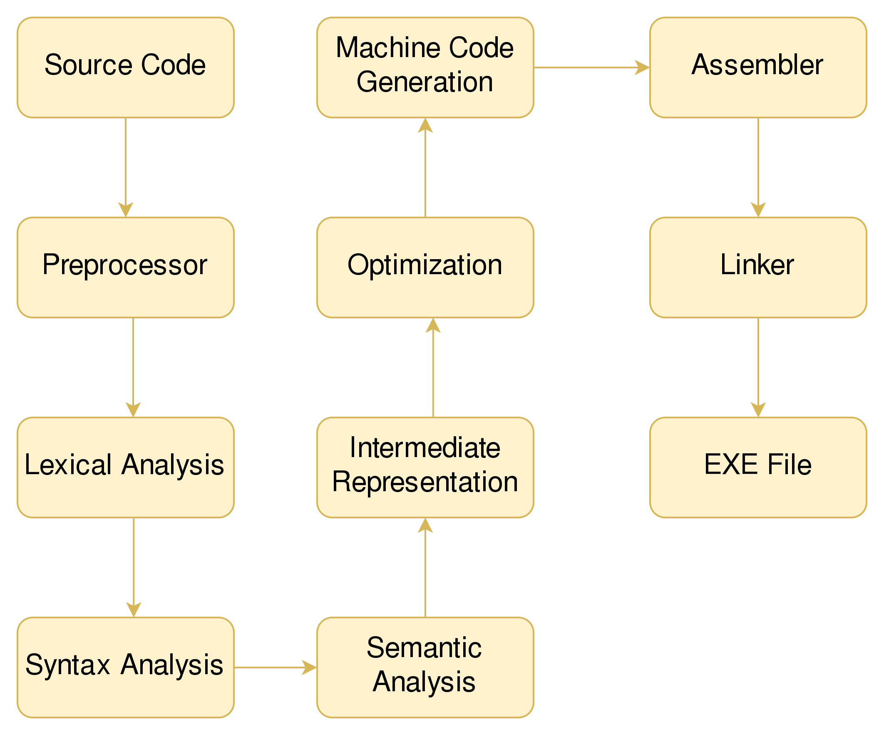
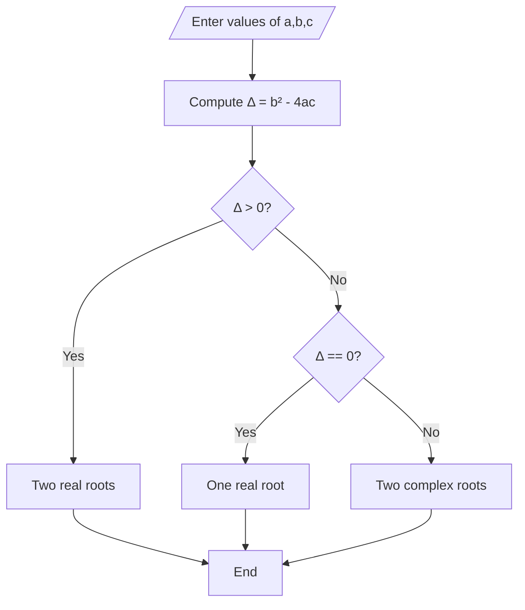

# المحاضرة 3
## أساسيات C++
### د. سهيل الحمود
### د. أسامه ناصر
2025-2026
---

# الفهرس
- تابع الـ main
- مراحل عمل المترجم
- أنواع المتحولات
	- الأعداد
	- الأنماط البوليانية
	- المحارف
- العمليات الرياضية في C++
- العمليات المنطقية في C++
 - مفهوم الخوارزميات
---
	
# تابع الـ main
- قمنا مسبقًا بتعريف البرنامَج على أنه مجموعة من التعليمات المتتالية التي يتم تنفيذها ضمن الحاسب
 - السؤال المهم من أين يجب أن يعرف نظام التشغيل من أي نقطة يجب البَدْء بتنفيذ البرنامَج؟
	 - بمعنى آخر تعليمة هي الأولى في التنفيذ؟
	 - تحديد ذلك يتم باستخدام التابع main
	 - أول تعليمة في البرنامَج هي أول تعليمة ضمن تابع الـ main
---

# تابع الـ main
<div grid="~ cols-2 gap-4">
<div>


<ul>
  <li v-click="1">السطر الثالث تعريف التابع:
  <ul>
  <li>اسم التابع main</li>
  <li>النمط المعاد (مستقر التابع) int</li>
  </ul>
  </li>
  <li v-click="2">السطر الثاني: أول تعليمة (كتابة العبارة welcome)</li>
  <li v-click="3">السطر الثالث: ثاني تعليمة (كتابة العبارة Hello world)</li>
  <li v-click="4">ناتج تنفيذ التابع القيمة 0 (في علوم الحاسب، القيمة 0 كخرج الـ main تعني أن البرنامَج نُفِّذ بنجاح)</li>
  <li v-click="5">كي نتمكن من الطباعة نستخدم توابع جاهزة من المكتبة iostream</li>
  <li v-click="6">ضمن الملف iostream يوجد تقسيم منطقي (مثل ملفات فرعية) تعرف باسم مجالات الأسماء namespaces، هنا نستخدم مجال الأسماء std</li>
</ul>
</div>
<div>
```cpp{|3|4|5|6|1|2}
#include<iostream>
using namespace std;
int main(){
	cout<<"welcome"<<endl;
	cout<<"Hello world"<<endl;
	return 0
}
```
</div>
</div>
---

# تابع الـ main
- أمثلة
<div grid="~ cols-2 gap-4">
<div>

```cpp
#include<iostream>
using namespace std;
int main(){
	int a;
	cin >> a;
	cout<<"The value "
	<<a<<endl;
	return 0;
}
```
</div>
<div>

```cpp
#include<iostream>
using namespace std;
int main(){
	int a,b,c;
	cin >>a>>b>>c;
	cout<<"The value "
	<<a*b+c<<endl;
	return 0;
}
```
</div>
<div>

```cpp
#include<iostream>
using namespace std;
int main(){
	int a,b;
	cin >> a >> b;
	cout<<"The value "
	<<a+b<<endl;
	return 0;
}
```
</div>
<div>

```cpp
#include<iostream>
using namespace std;
int main(){
	char a;
	cin >> a;
	cout<<"The value "
	<<a<<endl;
	return 0;
}
```
</div>
</div>
---

# مراحل عمل المترجم

<div grid="~ cols-2 gap-4">
<div>

- مرحلة Source
	- قراءة محتوى الملفات التي تحوي الكود Code
- مرحلة Preprocess
	- تتم معالجة التعليمات التي تبدأ بالحرف `#` مثل `incldue#`
-  مرحلة Lexical Analysis
	- قراءة التعليمات الموجودة ضمن البرنامج وتحويلها لرموز خاصة تسمى tokens
	- يتم اكتشاف الأخطاء البسيطة مثل استخدام رمز خاطئ
</div>
<div>

</div>
</div>
---

# مراحل عمل المترجم

<div grid="~ cols-2 gap-4">
<div>

-  مرحلة Syntax Analysis
	- يتم تحليل الـ tokens الناتجة عن المرحلة السابقة والتحقق من أنها تتبع قواعد اللغة، يتم اكتشاف الأخطاء القواعدية في هذه المرحلة
	- الخرج توصيف خاص بالمترجمات يعرف باسم Abstract Syntax Tree (AST)
-  مرحلة Semantic Analysis
	- يتحقق مما إذا كان الكود منطقيًا وفقًا لقواعد اللغة
	- يتم اكتشاف الأخطاء الدلالية في هذه المرحلة، وعادةً ما تكون أكثر وضوحًا ومعنى من أخطاء الصياغة (النحوية).
	- الخرج تمثيل وسيط Intermediate Representation
</div>
<div>

</div>
</div>
---


# مراحل عمل المترجم

<div grid="~ cols-2 gap-4">
<div>

- مرحلة التحسين Optimzation
	- يتم فيها مراجعة التمثيل الوسيط وإجراء تعديلات عليه لزيادة الأداء:
		- حذف تعلميات لن يتم تنفيذها
		- تغيير ترتيب العمليات لضمان أعلى سرعة تنفيذ ممكنة دون أن نغير النتيجة
		- تبسيط العلميات المعقدة إن أمكن
- مرحلة التوليد Machine Code Generation
	- يتم في هذه المرحلة توليد تعليمات بلغة الآلة
- مرحلة التجميع Assember
	- في هذه المرحلة يتم تجميع تعليمات الآلة ضمن ملفات خاصة (مثلًا ملف يعبر عن التعليمات التي أنت كتبتها وملف يعبر تعليمات المكتبة iostream)
</div>
<div>

</div>
</div>
---


# مراحل عمل المترجم

<div grid="~ cols-2 gap-4">
<div>

- مرحلة الربط Linker
	- في هذه المرحلة يتم ربط ملفات التجميع المختلفة ضمن ملف واحد ليتم عن طريقه توليد الملف التنفيذي EXE File
</div>
<div>

</div>
</div>
---

# مراحل عمل المترجم
- نلاحظ من الكلام السابق وجود نوعين من الأخطاء
	- أخطاء لغوية
		- إملائية
		- نحوية
	- دلالية
- نضيف عليهم نوع آخر هو المنطقية
- تفاصيل أكثر لاحقاً
---

# أنواع المتحولات
## تعريف المتحويلات
- المتحول هو حجرة ذاكرية تحتوي قيم خلال تنفيذ البرنامج
- مثلًا في حال كنا نريد بناء برنامج لحل المعادلات من الدرجة الثانية
$$
ax^2+bx+c=0
$$
- نحن هنا بحاجة 3 متحولات:
	- a مكان لتخزين قيمة أمثال $x^2$
	- b مكان لتخزين أمثال $x$
	- c مكان لتخزين قيمة الثابت
---

# أنواع المتحولات
- تصنف المتحولات للأنواع التالية:
	- رقمية
	- محارف
	- مؤشرات
	- مركبة
--- 

# أنواع المتحولات

- المتحولات الرقمية:
	- تستخدم لتخزين الأعداد ولها 3 أنواع:
		- فاصلة ثابتة
			- المؤشر
				- char (8 bits - 1 byte)
				- short (int) (16 bits - 2 bytes)
				- int (32 bits - 4 bytes)
				- long (int) (64 bits - 8 bytes)
			- الغير مؤشر
				- مثل سابقه تسبقه كلمة unsigned
--- 

# أنواع المتحولات

- المتحولات الرقمية:
	- تستخدم لتخزين الأعداد ولها 3 أنواع:
		- فاصل عائمة
			- float (32 bits - 4 bytes)
			- double (64 bits - 8 bytes)
		- بوليانية
			- bool (8 bits - 1 byte)
---

# أنواع المتحولات
## نظام العد الثنائي
 - There 10 types of people in this world
	 - Those who understand binary and those who don't
 - يستخدم نظام العد الثنائي لتخزين البيانات ضمن الحاسب ويكون فيه $10=2$
 - مثلًا
 $$
 1_{10}=1_{2}
\\
5_{10}=101_{2}
\\
15_{10}=1111_{2}
\\
32_{10}=100000_{2}
\\
1000_{10}=1111101000_{2}
 $$
---
 
# أنواع المتحولات
## نظام العد الثنائي
### التحويل من النظام العشري للثنائي في الأعداد الصحيحة:
- نقوم بتقسيم العدد الصحيح على 2
	- الباقي هو الخانة الثنائية
	- والناتج نتابع قسمته حتى يصبح 0
	- ممكن أمثلة؟
	- نعم لكن في محاضرات لاحقة
	- ضرورية لمعرفة كيف يتم تمثيل الأعداد الصحيحة والحقيقية في الحاسب
	- كيف تتم عمليات الجمع والطرح
	- Overflow
	- Underflow
---
 
# أنواع المتحولات
## الأنماط البوليانية
- هي أنماط تستخدم لتخزين إما 0=false أو 1=true
- تعتمد على الكلمة المحجوزة bool
```cpp
#include<iostream>
using namespace std;
int main(){
	bool x;
	x=false;
	cout<<x<<endl;
	return 0;
}
```
---
 
# أنواع المتحولات
## أنماط المحارف
- لدينا الأنماط التالية
	- char (signed 8 bits)
	- unsigned char (unsigned 8 bits)
	- char16_t (unsigned 16 bits)
	- char32_t (unsigned 32 bits)
- لنفهم ما يفيد كل منهم علينا التعرف على ASCII وEASCII وUnicode
--- 

# أنواع المتحولات
## أنماط المحارف
- **ASCII** هي اختصار لـ **American Standard Code for Information Interchange** (الكود الأمريكي القياسي لتبادل المعلومات).
- هو **معيار ترميز** ظهر في الستينيات من القرن الماضي، وكان الهدف منه إنشاء لغة مشتركة تمكن أجهزة الكمبيوتر والأجهزة الإلكترونية الأخرى من التواصل وفهم النصوص بطريقة موحدة.

ببساطة، يعتبر ASCII جدول يربط بين الأرقام والحروف والرموز التي نستخدمها في الكتابة على الشاشة أو الطابعة.
---

# أنواع المتحولات
## أنماط المحارف
### الفكرة الأساسية وراء عمل ASCII
- لا تفهم أجهزة الكمبيوتر سوى لغة الأرقام (النظام الثنائي: 0 و 1). لذلك، لتتمكن من تمثيل حرف مثل 'A' أو الرقم '7'، يحتاج الكمبيوتر إلى طريقة لتحويل هذه الرموز إلى أرقام.
- يقوم ASCII بهذه المهمة عن طريق:
	1. أخذ حرف أو رمز (مثل 'A').
	2. إعطاؤه رقمًا عشريًا معينًا (مثل 65).    
	3. يتم تخزين هذا الرقم العشري في الكمبيوتر على شكل رقم ثنائي (مثل 1000001).    
---

# أنواع المتحولات
## أنماط المحارف
### البنية الأساسية لـ ASCII
- يستخدم ASCII **7 بت (Bits)** لتمثيل كل حرف.
- بما أن البت يمكن أن يكون 0 أو 1، فهذا يعني أن هناك 2^7 = **128 رمزًا** مختلفًا يمكن تمثيلهم.
  - يتم تقسيم هذه الرموز الـ 128 إلى مجموعتين رئيسيتين:
	 1. رموز التحكم (0 - 31 و الرمز 127)
هذه رموز غير قابلة للطباعة، كانت تُستخدم في الأصل للتحكم في الأجهزة الطرفية مثل الطابعات أو أجهزة الاتصال. ومن الأمثلة المشهورة عليها:
		- **الرمز 10 (LF - Line Feed)**: يحرك المؤشر إلى السطر التالي (مثل زر "Enter" في لوحة المفاتيح).  
		- **الرمز 13 (CR - Carriage Return)**: يرجِع المؤشر إلى بداية السطر.
	    - **الرمز 27 (ESC - Escape)**: يستخدم للخروج من حالة معينة أو بدء تسلسل تحكم.
 	 	- **الرمز 9 (TAB - Horizontal Tab)**: ينشئ مسافة أفقية (Tab).  
		- **الرمز 0 (NUL - Null)**: يعبر عن نهاية السلسلة النصية.
---

# أنواع المتحولات
## أنماط المحارف
### البنية الأساسية لـ ASCII
  - يتم تقسيم هذه الرموز الـ 128 إلى مجموعتين رئيسيتين:
  
	2. الرموز القابلة للطباعة (32 - 126)
		هذه هي الرموز التي نراها على الشاشة ونستخدمها في الكتابة.
		- **الرمز 32 (Space)**: يمثل حيزًا فارغًا.
    	- **الأرقام (48-57)**: الرقم '0' يمثله الرقم 48، والرقم '1' يمثله 49، وهكذا حتى الرقم '9' الذي يمثله 57.
	    - **الحروف الكبيرة (65-90)**: الحرف 'A' يمثله الرقم 65، و'B' يمثله 66، ... حتى 'Z' الذي يمثله 90.
	    - **الحروف الصغيرة (97-122)**: الحرف 'a' يمثله الرقم 97، و'b' يمثله 98، ... حتى 'z' الذي يمثله 122.
	    - **رموز الترقيم والرموز الخاصة (بقية الأرقام)**: مثل !, @, #, $, %, &, *، إلخ.
---

# أنواع المتحولات
## أنماط المحارف
### البنية الأساسية لـ ASCII
<div class="flex justify-content-center">

</div>
---

# أنواع المتحولات
## أنماط المحارف
### E-ASCII (Extended ASCII)
- **Extended ASCII** هو امتداد لنظام ASCII الأساسي الذي يستخدم 7 بت، حيث تم الانتقال إلى استخدام **8 بت** (1 بايت) لتمثيل الحروف.
- هذا التطور سمح بتمثيل **256 رمزًا** بدلاً من 128 فقط، مضيفًا 128 رمزًا جديدًا.
#### لماذا ظهر Extended ASCII؟
- **محدودية ASCII الأصلي**: 128 رمزًا لم تكفِ لجميع احتياجات اللغات والرموز
- **الحاجة لرموز إضافية**: حروف متعددة، رموز رياضية، أشكال تخطيطية
- **كفاءة التخزين**: استخدام 8 بت (1 بايت) أصبح معيارًا في الأجهزة   
---

# أنواع المتحولات
## أنماط المحارف
### E-ASCII (Extended ASCII)
#### مشاكل Extended ASCII
1. **لا يوجد معيار واحد موحد**: بخلاف ASCII الأصلي (القياسي)، فإن Extended ASCII له **إصدارات متعددة** تعتمد على ما يسمى **"صفحات الرموز" (Code Pages)**.  
2. **عدم كفاية التعددية اللغوية**: لا تدعم اللغات الآسيوية أو عدة لغات معًا    
3. **فوضى الترميز**: قد تظهر رموز خاطئة إذا لم تكن صفحة الرموز متطابقة
---

# أنواع المتحولات
## أنماط المحارف
### E-ASCII (Extended ASCII)
#### أمثلة على صفحات الرموز الشهيرة:

1. **ISO-8859-1** (أو Latin-1)
- الأكثر شيوعًا في الغرب 
- يحتوي على حروف من لغات أوروبية غربية (مثل: é, ñ, ü, ø)   
- الرموز من 128 إلى 159 للتحكم، ومن 160 إلى 255 للرموز المطبعية
    
2. **Windows-1252**
- استخدمته مايكروسوفت في أنظمة ويندوز    
- مشابه لـ ISO-8859-1 مع بعض الاختلافات
- يحتوي على رموز العملة والكسور (مثل: €, ¢, ½)
---

# أنواع المتحولات
## أنماط المحارف
### E-ASCII (Extended ASCII)
#### 3. **صفحات رموز للغات أخرى**

- **Windows-1256**: للغة العربية  
- **ISO-8859-6**: للغة العربية أيضًا
- **Windows-1251**: للروسية
---

# أنواع المتحولات
## أنماط المحارف
### Unicode
- ما هو Unicode؟
	- **Unicode** هو معيار ترميز عالمي يهدف إلى تمثيل **جميع** رموز وأنظمة الكتابة في العالم باستخدام مجموعة رموز موحدة.
- الفكرة الأساسية من Unicode
	- بدلًا من وجود مئات أنظمة الترميز المختلفة (مثل ASCII، ISO-8859، Windows-1256)، أصبح لدينا **معيار واحد** يشمل:
		- جميع اللغات الحية والميتة  
		- الرموز الرياضية والعلمية
		- الرموز التعبيرية (Emoji)
		- رموز التقنية والأشكال المختلفة
---

# أنواع المتحولات
## أنماط المحارف
### Unicode
- لماذا ظهر Unicode؟
	- مشاكل الأنظمة السابقة:
		1. **التعارض بين الترميزات**: نفس الرقم قد يمثل حرفًا مختلفًا في أنظمة مختلفة  
		2. **عدم إمكانية دمج لغات متعددة**: لا يمكن جمع العربية والصينية والإنجليزية في نفس النص
		3. **فوضى الترميز**: صعوبة تبادل النصوص بين أنظمة مختلفة
---

# أنواع المتحولات
## أنماط المحارف
### Unicode
- المبادئ الأساسية لـ Unicode
	1. الشمولية
		- يدعم **جميع** أنظمة الكتابة في العالم
	    - يتم إضافة رموز جديدة باستمرار 
	2. الوحدة
		- كل حرف له رمز فريد **دون اعتبار للخط أو الحجم**
		- مثلاً: الحرف 'A' له نفس الرمز بغض النظر عن شكله في الخطوط المختلفة
	 3. التمثيل الفردي
		- كل رمز له تمثيل واحد ثابت
---

# أنواع المتحولات
## أنماط المحارف
### Unicode    
- كيف يعمل Unicode؟
	- النقاط البرمجية (Code Points)
		- كل حرف/رمز في Unicode له **رقم فريد** يسمى "نقطة برمجية"
	    - يكتب عادة بصيغة `U+` متبوعة بأرقام ست عشرية
    - أمثلة:
        - `A` → U+0041
	    - U+0628 →  `ب`
	    - U+1F60A → `😊`
	    - `水` → U+6C34
---

# أنواع المتحولات
## أنماط المحارف
### Unicode
- بعض مجالات القيم في Unicode 

| النطاق | المحتوى | أمثلة |
|---------|-----------|--------|
| U+0000 - U+007F | Latin-1 Supplement | é, ñ, ü |
| U+0600 - U+06FF | العربية | ب, ت, ث, ... |
| U+1F600 - U+1F64F	| الإيموجي	| 😀, 😂, 🎉|
| U+4E00 - U+9FFF | المقاطع الصينية | 水, 火, 木 |
---

# العمليات الرياضية في  C++
<div grid="~ cols-2 gap-4">
<div>

- تدعم لغة C++ العمليات الرياضية التالية:
	- الجمع +
	- الطرح -
	- الضرب *
	- القسمة /
	- باقي القسمة %
-  كما تدعم عمليات الزيادة والإنقاص السريعة
	- `++i`
	- `i++`
	- `--i`
	-  `i--`
</div>
<div>

- عمليات الأسناد السريعة
$$
a+=b~\equiv~a=a+b
\\
a-=b~\equiv~a=a-b
\\
a*=b~\equiv~a=a*b
\\
a/=b~\equiv~a=a/b
\\
a \% =b~\equiv~a=a \% b
$$
</div>
</div>
---

# العمليات الرياضية في  C++
- ما خرج البرنامج التالي:
<div grid="~ cols-2 gap-4">
<div>
<ul>
	<li v-click="1">
	0
	<ul>
	<li v-click="2">
	تنفيذ العملية ثم زيادة القيمة i=i+1
	</li>
	</ul>
	</li>
	<li v-click="3">
	2
		<ul>
	<li v-click="4">
	ننفيذ زيادة القيمة بمقدار 1 ثم ننفذ العملية
	</li>
	</ul>
	</li>
	<li v-click="5">
	20
	<ul>
	<li v-click="6">
	تنفيذ العملية ثم ننقص القيمة i=i-1
	</li>
	</ul>
	</li>
	<li v-click="7">
	18
	<ul>
	<li v-click="6">
	ننفيذ إنقاص القيمة بمقدار 1 ثم ننفذ العملية
	</li>
	</ul>	
	</li>		
</ul>
</div>
<div>
```cpp{|5|5|6|6|8|8|9|9}
#include<iostream>
using namespace std;
int main(){
	int i=0;
	cout<< i++ << endl;
	cout<< ++i << endl;
	int j=20;
	cout<< j-- << endl;
	cout<< --j << endl;
}
```
</div>
</div>
---
 

# العمليات الرياضية في C++
- تدعم لغة C++ العمليات المنطقية التالية:
	- `&` تعبر عن الضرب المنطقي (تقاطع)
	- `|` تعبر عن الجمع المنطقي (اجتماع)
	- `!` النفي (المتمم)
	- `^` عدم التشابه (لاحقًا في مقرر الدارات المنطقية)
	- `<<` الإزاحة نحو اليمين (سيتم التعرف عليه في مقررات لاحقة)
		- نحن نستخدم هذا الرمز مع cin أي أننا نزيح الـ cin نحو اليمين؟
			- لا وإنما نقوم بما يعرف بالتحميل الزائد للعمليات operator overloading (في الفصل القادم)
	- `>>` الإزاحة نحو اليسار (سيتم التعرف عليه في مقررات لاحقة)
		- نحن نستخدم هذا الرمز مع cout أي أننا نزيح الـ cout نحو اليسار؟
			- لا وإنما نقوم بما يعرف بالتحميل الزائد للعمليات operator overloading (في الفصل القادم)
---

# الخوارزميات
- التعريف 
**هي مجموعة من الخطوات المنتهية التي تهدف لحل مشكلة ما**
- لفهم الخوارزميات، سنعمل على حل معادلة من الدرجة الثانية
	- الخطوات هي:
		- حساب المميز $\Delta=b^2-4ac$
		- وفقًا لقيمة المميز:
			- $\Delta >0$ جذرين
				- $x_1=\frac{-b-\sqrt{\Delta}}{2a}$
				- $x_1=\frac{-b+\sqrt{\Delta}}{2a}$
			- $\Delta=0$
				- $x_1=x_2=\frac{-b}{2a}$
			- $\Delta<0$
				- جذر تخيلي
---

# الخوارزميات
- نجد مما سبق أن لدينا مجموعة من الخطوات المنتهية لحل المعادلة الدرجة الثانية
- فإذًا هي خوارزمية
- كيف نعبر عن الخوارزمية
	- كتابة نص بسيط (مناسب للخوارزميات الصغيرة)
	- مخطط تدفقي مناسب للخوارزميات المتوسطة
	- Pseudo-Code خليط من الكود واللغة الإنكليزية يستخدم في الخوارزميات بغض النظر عن الحجم
--- 

# الخوارزميات
## المخطط التدفقي
<div grid="~ cols-2 gap-4">
<div>

- مربعات متوازي الأضلاع تعني عمليات إدخال وإخراج
- المعين يعني عملية شرطية
</div>
<div style="transform: scale(0.8); transform-origin: top left;">

</div>
</div>
---

# الخوارزميات
## الـ Pseudo Code

<div class="grid grid-cols-2 gap-6" dir="ltr">

<!-- LEFT COLUMN -->
<div>
<pre>
Algorithm SolveQuadratic(a, b, c):
1. if a == 0:
       print("Not a quadratic equation")
       return
2. Delta = b^2 - 4 * a * c
3. if Delta > 0:
       x1 = (-b + sqrt(Delta)) / (2 * a)
       x2 = (-b - sqrt(Delta)) / (2 * a)
       print("Two real roots:", x1, x2)
</pre>
</div>
<div>
<pre>
4. else if Delta == 0:
       x = -b / (2 * a)
       print("One real root:", x)
5. else:
       realPart = -b / (2 * a)
       imaginaryPart = sqrt(abs(Delta)) / (2 * a)
       x1 = realPart + i * imaginaryPart
       x2 = realPart - i * imaginaryPart
       print("Two complex roots:", x1, x2)
6. return
</pre>
</div>
</div>
