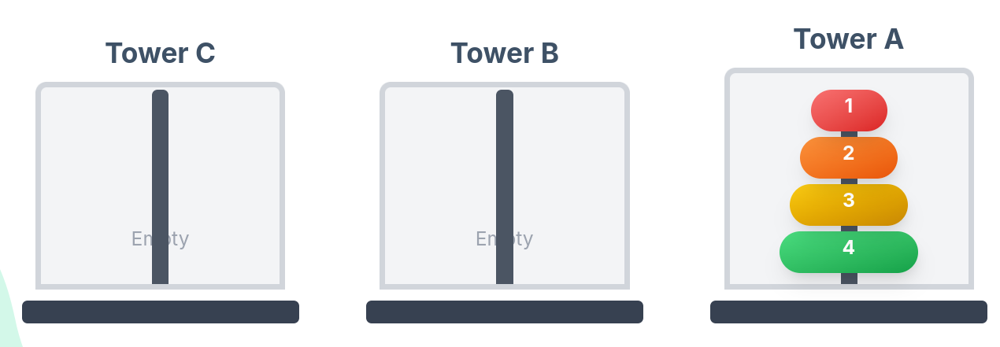

# المحاضرة 7

## الدوال (التوابع): functions

##  مقدمة عن التوابع في لغة البرمجة ++c

### د. سهيل الحمود

### د. أسامه ناصر

2025-2026
---

# مقدمة عن الدوال Functions

* الدالة **Function** هي مجموعة تعليمات برمجية لها اسم محدد.
* يتم استدعاؤها لتنفيذ مهمة معينة داخل البرنامج.
* الهدف من استخدام الدوال:

    * تنظيم الكود وتقسيمه.
    * إعادة استخدام الكود.
    * تسهيل الفهم والصيانة.
    * تقليل التكرار.


---

# لماذا نستخدم الدوال؟

* تخيل برنامجًا كبيرًا بدون دوال يحوي مئات المتغيرات العامة و الاجزاء المكررة
* باستخدام الدوال نستطيع:

    * تقسيم البرنامج إلى أجزاء منطقية.
    * اختبار كل جزء بشكل منفصل.
    * كتابة كود نظيف وواضح.

---

# الدالة ()main 

* كل برنامج C++ يحتوي على دالة رئيسية اسمها `()main`
* يبدأ تنفيذ البرنامج منها.
* `()main` هي أول دالة يتم استدعاؤها تلقائيا عند تشغيل البرنامج.

```cpp
int main() {
    return 0;
}
```

---

# الشكل العام للدالة

<div class="grid grid-cols-1 gap-4">
<div>

```cpp
return_type function_name(parameters) {
    // statements
    return value;
}
```

</div>
<div>

* **Return Type** : نوع القيمة المرجعة
* **Function Name** : اسم الدالة
* **Parameters** : المعاملات (اختيارية)
* **Body** : جسم الدالة

</div>

</div>

---

# مثال على دالة بسيطة

```cpp
int sum(int a, int b) {
    return a + b;
}
```

* اسم الدالة: `sum`
* نوع القيمة الراجعة: `int`
* المعاملات: `a` و `b`
* القيمة المرجعة: مجموع العددين

---

# تعريف وتصريح الدالة

## 1️⃣ تصريح الدالة (Function Prototype)

* يخبر المترجم بوجود دالة قبل استخدامها.

```cpp
int sum(int, int);
```

## 2️⃣ تعريف الدالة
تحقيقها و تنفيذها
```cpp
int sum(int a, int b) {
    return a + b;
}
```

---

# لماذا نستخدم Function Prototype؟

* عندما تكون الدالة معرفة ومكتوبة بعد `()main`
* يمنع أخطاء الترجمة
* يجعل الكود أوضح ومنظمًا

---

# استدعاء الدالة (Calling a Function)

<div class="grid grid-cols-2 gap-4">
<div>

* يتم استدعاء الدالة باستخدام اسمها.
* نمرر لها القيم المطلوبة (Arguments).
* يمكن تخزين الناتج في متغير.

</div>
<div>

```cpp
int result = sum(3, 5);
```

</div>
</div>

---

# مثال كامل

```cpp
#include <iostream>
using namespace std;

int sum(int, int);

int main() {
    int x = 2, y = 4;
    cout << sum(x, y);
    return 0;
}

int sum(int a, int b) {
    return a + b;
}
```

---

# الدوال التي ترجع قيمة

* تعيد قيمة باستخدام `return`
* يجب أن يطابق النوع المعرف في ترويسة التابع نوع القيمة التي تم إرجاعها

```cpp
float average(int a, int b) {
    return (a + b) / 2.0;
}
```

---

# الدوال بدون قيمة مرجعة (void)

* لا تعيد أي قيمة
* يمكن أن يكون لها آثار جانبية

```cpp
void display() {
    cout << "Hello World";
}
```

---

# المعاملات Parameters

* هي متغيرات شكلية (formal) تستقبل القيم داخل الدالة.
* تسمح بجعل الدالة عامة وقابلة لإعادة الاستخدام.

```cpp
int square(int x) {
    return x * x;
}
```

---

# Parameters vs Arguments

| Parameters      | Arguments          |
| --------------- | ------------------ |
| في تعريف الدالة | عند استدعاء الدالة |
| متغيرات         | قيم فعلية          |

---

# الاستدعاء بالقيمة (Call by Value)

* يتم إرسال **نسخة** من المتغير.
* أي تعديل لا يؤثر على المتغير الأصلي.

```cpp
void change(int x) {
    x = 10;
}
```

---

# الاستدعاء بالمرجع (Call by Reference)

* يتم إرسال عنوان المتغير.
* التعديل يؤثر على المتغير الأصلي.

```cpp
void change(int &x) {
    x = 10;
}
```

---

# مثال: تبديل قيمتي متغيرين


```cpp
void swap(int &a, int &b) {
    int temp = a;
    a = b;
    b = temp;
}
```

---

# المعاملات الافتراضية (Default Arguments)

* يمكن إسناد قيم افتراضية إلى المعاملات بحيث يتم استخدامها في حال تم استدعاء التابع بدون إعطاء قيمة لهذه المعاملات.
* المعاملات الافتراضية يجب أن تكون آخر معاملات ضمن تعريف التابع

```cpp
int add(int a, int b = 5) {
    return a + b;
}
```

---

# التحميل الزائد للدوال (Function Overloading)

* يتم عندما يكون لدينا عدة دوال بنفس الإسم.
* هذه الدوال تختلف فيما بينها في عدد أو في نوع المعاملات.

```cpp
int add(int a, int b);

double add(double a, double b);
```

---

# الدوال المضمنة Inline Functions

* تطلب من المترجم استبدال الدالة بالكود مباشرة.
* تستخدم للدوال الصغيرة.

```cpp
inline int cube(int x) {
    return x * x * x;
}
```

---

# نطاق المتغيرات (Scope)

* **Local Variable**: داخل الدالة فقط
* **Global Variable**: خارج جميع الدوال

```cpp
int x = 5; // Global
```

---

# أخطاء شائعة عند استخدام الدوال

* نسيان `return`
* اختلاف نوع القيمة الراجعة
* عدد معاملات خاطئ
* تحقيق بدون تصريح


---


#  الاستدعاء العودي Recursion؟

* الاستدعاء العودي هو أسلوب برمجي تقوم فيه الدالة **باستدعاء نفسها**.
* يُستخدم لحل المسائل التي يمكن تقسيمها إلى مسائل أصغر من نفس النوع.
* كل دالة عودية تتكوّن من جزأين أساسيين:

    * **الحالة الأساسية (Base Case)**
    * **الحالة العودية (Recursive Case)**

---

# لماذا نستخدم Recursion؟

* تبسيط حل بعض المسائل المعقدة.
* مناسب لمسائل مثل:

    * حساب العاملي ! (Factorial)
    * متسلسلة فيبوناتشي
    * خوارزميات البحث في البنى الشجرية (لاحقا)
* يجعل الكود أقرب للوصف الرياضي للمشكلة.

---

# الشكل العام للدالة العودية

```cpp
return_type function_name(parameters) {
    if (base_condition) {
        return base_value;
    }
    return function(smaller_problem);
}
```

---

# مكونات الدالة العودية

<div class="grid grid-cols-2 gap-4">
<div>

### 1️⃣ الحالة الأساسية Base Case

* توقف الاستدعاء العودي.
* بدونها يحدث **استدعاء لا نهائي**.

### 2️⃣ الحالة العودية Recursive Case

* تستدعي الدالة نفسها بقيم أصغر.

</div>
<div>

```cpp
int func(int n) {
    if (n == 0)
        return 1;
    return n * func(n - 1);
}
```

</div>
</div>

---

# مثال 1: حساب مضروب العاملي ! Factorial


<div class="grid grid-cols-2 gap-8">

<div>

## التعريف الرياضي

```text
n! = n × (n-1)!  
0! = 1
```

</div>

<div>

## الكود باستخدام Recursion

```cpp
int factorial(int n) {
    if (n == 0)
        return 1;
    return n * factorial(n - 1);
}
```
</div>


</div>

---

# Factorial(4)
<div class="grid grid-cols-2 gap-4">

<div>

## خطوات تنفيذ  

1. `factorial(4)` → `4 * factorial(3)`
2. `factorial(3)` → `3 * factorial(2)`
3. `factorial(2)` → `2 * factorial(1)`
4. `factorial(1)` → `1 * factorial(0)`
5. `factorial(0)` → `1` ✅
</div>

<div>

##  تمثيل شجري للاستدعاء العودي

```
factorial(4)
 └─ factorial(3)
     └─ factorial(2)
         └─ factorial(1)
             └─ factorial(0)
```
</div>


</div>


---

# مثال 2: متسلسلة فيبوناتشي Fibonacci

## التعريف
هي سلسلة أعداد, كل عدد فيها يساوي مجموع العددين السابقين له.
تبدأ السلسلة عادة بالرقمين  0، 1 وتكون على الشكل: 0، 1، 1، 2، 3، 5، 8، …

```cpp
F(n) = F(n-1) + F(n-2)
F(0) = 0 , F(1) = 1
```

---

## كتابة كود لحساب فيبوناتشي

<div class="grid grid-cols-2 gap-4">


<div>

### ملاحظات 

* هذا الحل غير فعّال للأرقام الكبيرة.
* يسبب عددًا كبيرًا من الاستدعاءات.
* الهدف منه تعليمي فقط لفهم الاستدعاء العودي Recursion.

</div>

<div>

```cpp
long fib(long n) {
    if (n <= 1)
        return n;
    return fib(n - 1) + fib(n - 2);
}
```
</div>

</div>

---

# Recursion vs Loop

| Recursion      الاستدعاء العودي | Loop   الحلقات       |
|---------------------------------|----------------------|
| أسهل للفهم في بعض المسائل       | أسرع في الأداء       |
| يستهلك ذاكرة أكثر               | أقل استهلاكا للذاكرة |
| يعتمد على بنية المكدس Stack     | أبسط في التنفيذ      |

---

## أخطاء شائعة في كتابة دالّة عودية Recursion

* نسيان الحالة الأساسية 
* الحالة الأساسية غير صحيحة 
* عدم تقليل حجم المشكلة 

## استخدام الحلقات Loops بدل الاستدعاء العودي Recursion

* عند وجود حل تكراري بسيط
* عند الحاجة لسرعة تنفيذ و كفاءة باستخدام الذاكرة

---

# مثال آخر عن كتابة تابع عودي 

## طباعة الأرقام من n إلى 1 باستخدام Recursion

```cpp
void print(int n) {
    if (n == 0)
        return;
    cout << n << " ";
    print(n - 1);
}
```


---

# مسألة أبراج هانوي (Tower of Hanoi)


<div class="grid grid-cols-2 gap-4">

<div>

* هي مسألة تقليدية تُستخدم لشرح مفهوم **الاستدعاء العودي (Recursion)**.
* الهدف: نقل جميع الأقراص من البرج **A** إلى البرج **C** باستخدام البرج **B** كمساعد.
  

</div>
<div>

* القواعد:
    * نقل قرص واحد فقط في كل مرة.
    * يسمح بنقل القرص العلوي فقط من أي برج.
    * لا يجوز وضع قرص أكبر فوق قرص أصغر.
* أقل عدد حركات لحل المسألة هو:
  **2ⁿ − 1** حيث n عدد الأقراص.

</div>
</div>


---


<TowerOfHanoi />


---


```cpp
#include <iostream>
using namespace std;

void hanoi(int n, char src, char dist, char aux) {
  if (n == 1) { // Base case
    cout << "Move disk 1 from " 
         << src << " to " << dist << endl;
    return;
  }

  hanoi(n - 1, src, aux, dist);

  cout << "Move disk " << n << " from " 
       << src << " to " << dist << endl;

  // Move n-1 disks from auxiliary to destination
  hanoi(n - 1, aux, dist, src);
}
```

---


# أبراج هانوي  Hanoi's Tower


```cpp
int main() {
    int n;
    cout << "Enter number of disks: ";
    cin >> n;

    hanoi(n, 'A', 'C', 'B');
    return 0;
}

```


